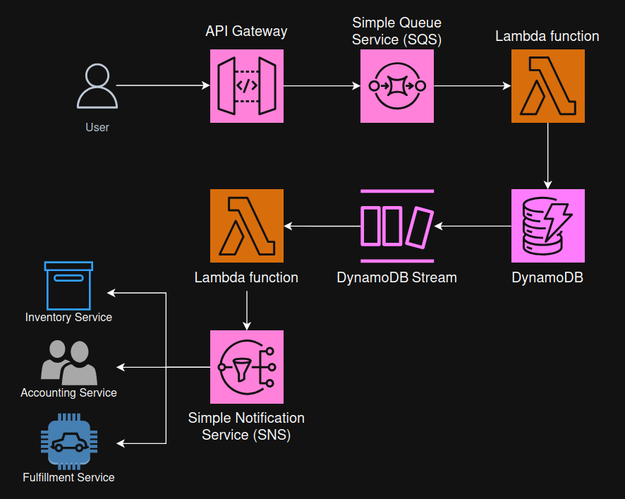

**Project Name: "Architecting Solutions on AWS"**

**Case 1: "Designing a serverless web backend on AWS"**

```
🧠 Customer Point of View (What they really want)

🏢 Business Context
- Global e-commerce company selling cleaning products
- Multiple front ends:
    - Public website & app (retail customers)
    - Wholesale website (business buyers)
- Orders flow:
    - Frontend → Orders Service (on-prem) → downstream services (already in AWS)

⚠️ Core Problems (Customer Pain Points)

1. ❌ Scalability Issues
- Current system cannot handle spiky traffic
- During sales/campaigns:
    - System slows down or crashes
    - Orders fail or get delayed
- On-prem requires over provisioning hardware

👉 Customer need:
- Automatic scaling (up & down)
- No manual infrastructure management

2. ❌ Monolithic / Tightly Coupled Architecture
- All logic is inside one big service
- If one part fails → everything fails

Example issue:
- Inventory call succeeds
- App crashes before accounting call -> Leads to inconsistent system state

👉 Customer need:
- -Decoupled architecture
- Independent processing of steps

3. ❌ Reliability & Data Consistency Issues
- Failures during processing lead to:
    - Missing updates in downstream systems
    - Data inconsistency
    - Customer-facing issues

👉 Customer need:
- Fault-tolerant system
- Guaranteed processing (no lost orders)

4. ❌ Operational Overhead (Database + Infra)
- Using on-prem MySQL
- Only one table, but still managing full DB instance
- Time-consuming maintenance

👉 Customer need:
- Fully managed, low-maintenance database
- High availability & durability

5. ❌ Lack of Elasticity
- Traffic pattern:
    - Very spiky
    - Sometimes zero load
- Current infra:
    - Cannot scale down efficiently

👉 Customer need:
- Pay only for usage
- Elastic infrastructure

6. ❌ Observability Gaps
- Monitoring & logging not unified

👉 Customer need:
- Easy-to-implement monitoring
- Centralized logging system

7. ⚖️ Cost & Performance Concerns
- Wants optimal balance:
    - High performance
    - Low cost

👉 Customer need:
- Cost-efficient architecture
- No over provisioning

8. 🔄 Migration Strategy Shift
- Previously: Lift-and-shift
- Now: Full cloud-native rewrite

👉 Customer need:
- Use cloud-native services
- improve system design, not just move it
```

```
🏗️ Serverless Order Processing Architecture (AWS) Solution

📌 This solution redesigns the existing monolithic order service into a serverless, event-driven architecture on AWS.
👉 The goal is to achieve:
- High scalability (handle spiky traffic)
- Loose coupling between components
- Improved reliability and fault tolerance
- Reduced latency for end users
- Lower operational overhead
```

```
The architecture follows an asynchronous processing model, where requests are accepted immediately and processed in the background.

🔄 End-to-End Flow (Step-by-Step)
👉 1. API Entry Point

Component: Amazon API Gateway

What happens:
- Frontend clients (web/mobile) send order requests
API Gateway:
- Authenticates the request
- Validates request structure (payload)
- Forwards valid requests to the queue

Why:
- Acts as a secure and scalable front door
- Removes need for managing web servers
- Ensures only valid requests enter the system

👉 2. Message Queue (Decoupling Layer)

Component: Amazon SQS

What happens:
- API Gateway pushes the order message into an SQS queue
- The system immediately responds to the user (no waiting)

Why:
- Enables asynchronous processing → reduces frontend latency
- Decouples API from backend processing
- Buffers traffic spikes (prevents system overload)
- Guarantees message durability (no lost orders)

👉 3. Order Processing Compute

Component: AWS Lambda

What happens:
- Lambda automatically polls SQS
- When messages arrive:
- Executes business logic
- Processes the order
- Stores the order in the database

Why:
- Fully serverless → automatic scaling
- Processes messages at system capacity
- Prevents overload during high traffic bursts

👉 4. Data Storage

Component: Amazon DynamoDB

What happens:
- Processed orders are stored in a DynamoDB table
- Each write generates a DynamoDB Stream event

Why:
- Fully managed, highly available, and durable
- Scales automatically with demand
- Eliminates database maintenance overhead
- Streams enable event-driven workflows

👉 5. Event Trigger (Change Data Capture)

Component: DynamoDB Streams

What happens:
- Every new order triggers a stream event
- This event invokes another Lambda function

Why:
- Enables event-driven architecture
- Ensures downstream processing starts only after data is stored
- Decouples storage from further processing

👉 6. Downstream Processing Trigger

Component: AWS Lambda

What happens:
- Lambda reads from DynamoDB Streams
- Publishes order details to a messaging service

Why:
- Separates core order logic from integrations
- Improves modularity and maintainability

👉 7. Fan-Out to Downstream Services

Component: Amazon SNS

What happens:
- SNS publishes the order event
- Multiple subscribers receive it:
- Inventory service
- Fulfillment service
- Accounting service

Why:
- Implements fan-out pattern
- Each service processes independently
- Prevents cascading failures between services
```
```
⚙️ Architectural Principles Applied

🔹 Asynchronous Processing
    - Orders are accepted instantly
    - Processing happens in the background

Benefit:
    - Lower latency for end users
    - Better user experience

🔹 Loose Coupling
    - Components communicate via SQS/SNS (not direct calls)

Benefit:
    - Failure in one service does NOT affect others
    - Easier scaling and maintenance

🔹 Scalability
    - Lambda and DynamoDB scale automatically
    - SQS buffers sudden traffic spikes

Benefit:
    - Handles unpredictable, spiky workloads

🔹 Fault Tolerance & Reliability
    - Messages persist in SQS until processed
    - Retry mechanisms ensure completion

Benefit:
    - No lost orders
    - System remains stable under failure

🔹 Cost Optimization
    - Serverless model (pay-per-use)
    - No idle infrastructure

Benefit:
    - Reduced operational and infrastructure costs
```
```
👉 Summary:

​- You have the frontend clients making requests, ​sending in orders through their phones, browsers, et cetera. 
- ​All these requests are going to be directed ​to Amazon API Gateway, ​which acts as the front door for the API. 
​- API Gateway will handle the authentication for the request, ​and it will also validate the format ​of the incoming request ​to verify that all the necessary fields ​are included in the payload of the request. 
- ​Once it passes through the authentication and validation, ​API Gateway will then send the message to an SQS queue. 
​- The message will remain in the queue ​until an AWS Lambda function ​is spun up to process the message. 
​- This happens quickly, and it's all automated ​because there is a polling mechanism built into AWS Lambda ​that will read the messages from the queue. 
​- Putting SQS between API Gateway and Lambda ​is decoupling the API from compute. So that way, if you have a large scaling event ​and you reach any predefined limits for the Lambda, ​the messages will be in the queue and will not be lost. 
​- Then, Lambda can churn through the messages and catch up. ​Or to catch up even faster, ​you can raise your Lambda limits ​and process the messages that are in the queue. 
​- This Lambda function will contain the application code ​for the order service related to order processing ​and storing the orders. 
​- The orders will be stored in an Amazon DynamoDB table. ​Once an order is stored in the table, ​an entry gets added to the DynamoDB stream, ​which then will need to be processed ​to send the order to the downstream functions. 
​- This is where another Lambda function comes into play. ​And this Lambda function ​will read the information on the DynamoDB stream ​and publish the order information to Amazon SNS. 
​- SNS, then following a fan-out pattern ​that will send that message ​to all of the subscribed endpoints. 
​- Those endpoints being the three downstream services ​for fulfillment, accounting, and inventory
```

```
👉 AWS Services explanation:

⚙️ AWS Lambda

- AWS Lambda is a compute service that provides serverless compute functions that run in response to events or triggers. 
- When an event or trigger is detected, a Lambda function is spun up in its own secure and isolated runtime environment, which is called an execution environment. 
- Lambda functions can run for up to 15 minutes. Any processes that need longer than 15 minutes to run should use other compute services on AWS for hosting. 
- Each execution environment stays active for a period of time, and then it shuts down on its own. 

- When you use Lambda, you are responsible only for your code, which can make it easier to optimize for operational efficiency and low operational overhead. 
- Lambda manages the compute fleet, which offers a balance of memory, CPU, network, and other resources to run your code. Because Lambda manages these resources, you can’t log in to compute instances or customize the operating system on the provided runtimes. 
- Lambda performs operational and administrative activities on your behalf, including managing capacity, monitoring, and logging your Lambda functions.

- Lambda can be used for virtually any application or backend that requires compute and that runs in under 15 minutes. 
- Common use cases are web backends, Internet of Things (IoT) backends, mobile backends, file or data processing, stream or message processing, and more. 
- Lambda is a good choice for use cases where the requirements include reducing operational overhead, optimizing for cost, or optimizing for performance efficiency. 
- Lambda works well for these use cases because it’s a managed service and you only pay for what you use. There are no idling resources when working with AWS Lambda, which means that each Lambda function is highly performant and cost efficient. 


⚙️ Amazon API Gateway

- API Gateway is a fully managed service that makes it easier for developers to create, publish, maintain, monitor, and secure APIs at any scale. 
- APIs act as the front door for applications, so that the applications can access data, business logic, or functionality from your backend services. 
- By using API Gateway, you can create RESTful APIs and WebSocket APIs that enable real-time two-way communication applications. 
- API Gateway supports containerized and serverless workloads, as well as web applications.

- API Gateway handles all the tasks involved in accepting and processing up to hundreds of thousands of concurrent API calls, including traffic management, CORS support, authorization and access control, throttling, monitoring, and API version management. 
- API Gateway has no minimum fees or startup costs. You pay for the API calls you receive and the amount of data transferred out and, with the API Gateway tiered pricing model, you can reduce your cost as your API usage scales.


⚙️ Amazon DynamoDB

- Amazon DynamoDB is a fully managed NoSQL database service that provides fast and predictable performance with seamless scalability. 
- By using DynamoDB, you can offload the administrative burdens of operating and scaling a distributed database so that you can reduce your need to handle hardware provisioning, setup and configuration, replication, software patching, or cluster scaling. 
- DynamoDB also offers encryption at rest, which reduces your operational burden and the complexity involved in protecting sensitive data. 

- With DynamoDB, you can create database tables that can store and retrieve virtually any amount of data and serve virtually any level of request traffic. 
- You can scale up or scale down your tables' throughput capacity with minimal downtime or performance degradation.

- NoSQL is a term used to describe nonrelational database systems that are highly available, scalable, and optimized for high performance. Instead of the relational model, NoSQL databases (such as DynamoDB) use alternate models for data management, such as key-value pairs or document storage. 

- In DynamoDB, tables, items, and attributes are the core components that you work with. 
- A table is a collection of items, and each item is a collection of attributes. DynamoDB uses primary keys to uniquely identify each item in a table, and secondary indexes to provide more querying flexibility. 
- You can use DynamoDB Streams to capture data modification events in DynamoDB tables.


⚙️ Amazon DynamoDB Streams

- DynamoDB Streams captures a time-ordered sequence of item-level modifications in any DynamoDB table, and stores this information in a log for up to 24 hours. 
- Applications can access this log and view the data items as they appeared, before and after they were modified, in near-real time.
- Encryption at rest encrypts the data in DynamoDB streams.
- DynamoDB Streams helps ensure the following:

    Each stream record appears exactly one time in the stream.

    For each item that is modified in a DynamoDB table, the stream records appear in the same sequence as the actual modifications to the item.

- DynamoDB Streams writes stream records in near-real time so that you can build applications that consume these streams and take action based on the contents.
- You can enable a stream on a new table when you create it by using the AWS Command Line Interface (AWS CLI) or one of the AWS SDKs. 
- You can also enable or disable a stream on an existing table, or change the settings of a stream. 
- DynamoDB Streams operates asynchronously, so table performance isn’t affected if you enable a stream.
- All data in DynamoDB Streams is subject to a 24-hour lifetime. You can retrieve and analyze the last 24 hours of activity for any given table. However, data that is older than 24 hours is susceptible to trimming (removal) at any moment.


⚙️ Amazon SNS

- Amazon SNS is a managed service that provides message delivery from publishers to subscribers (which are also known as producers and consumers). 
- Publishers communicate asynchronously with subscribers by sending messages to a topic, which is a logical access point and communication channel. 
- Clients can subscribe to the SNS topic and receive published messages by using a supported endpoint type, such as Amazon Kinesis Data Firehose, Amazon SQS, AWS Lambda, HTTP, email, mobile push notifications, and mobile text messages through Short Message Service (SMS).


⚙️ Amazon SQS

- Amazon SQS is a fully managed, message queuing service that you can use to decouple and scale microservices, distributed systems, and serverless applications. 
- Amazon SQS reduces the complexity and overhead associated with managing and operating message-oriented middleware, which means that developers can focus on differentiating work. 
- By using Amazon SQS, you can send, store, and receive messages between software components at virtually any volume, without losing messages or requiring other services to be available.

- It enables asynchronous model, where the order is first stored, and then processed shortly after. 
- With this model, end user can receive a response more quickly from the backend. When the backend system receives an order, it can immediately respond and then process the request asynchronously. 

- A loosely coupled architecture minimizes the bottlenecks that are caused by synchronous communication, latency, and I/O operations. 
- Amazon SQS and AWS Lambda are often used to implement asynchronous communication between different services.
- You should consider using this pattern if you have the following requirements:
    - You want to create loosely coupled architecture.
    - All operations don’t need to be completed in a single transaction, and some operations can be asynchronous.
    - The downstream system can’t handle the incoming transactions per second (TPS) rate. The messages can be written to the queue and processed based on the availability of resources.

A disadvantage of this pattern is that the actions of business transaction are synchronous. Even though the calling system receives a response, some part of the transaction might still continue to be processed by downstream systems.
```

```
🚀 Architecture Improvements
“The architecture can be further optimized by adding caching with DAX, tuning DynamoDB and Lambda performance, improving code reuse with layers, enhancing event routing with EventBridge, and strengthening observability using CloudWatch and Lambda Powertools.”
```
```
1. ⚡ Database Performance Optimization

🔹 Option A: Add Cache Layer
    - Service: Amazon DynamoDB Accelerator (DAX)
Improvement:
    - Introduce DAX between Lambda and DynamoDB
Benefits:
    - Microsecond latency (very fast reads)
    - Reduces direct load on DynamoDB
Consideration:
    - Adds cost
    - Should be used only if performance is insufficient

🔹 Option B: Optimize DynamoDB Design
Improvement:
    - Tune table structure
    - Add indexes (GSI/LSI)
Benefits:
    - Better query performance without extra cost
    - More efficient data access patterns

🔹 Best Practice
    - Perform A/B testing (with vs without DAX)
    - Use Infrastructure as Code to simulate environments

2. ⚙️ Lambda Performance & Cost Optimization

🔹 Memory & CPU Tuning
    - Tool: AWS Lambda Power Tuning
Improvement:
    - Adjust memory allocation for Lambda
Key Insight:
    - More memory → faster execution
    - Faster execution → lower total cost (less runtime)

🔹 Code Reuse with Layers
    - Feature: Lambda Layers
Improvement:
    - Move shared libraries into layers
Benefits:
    - Easier maintenance (update once, reuse everywhere)
    - Faster deployments
    - Cleaner codebase

🔹 Code-Level Optimization
Improvement:
    - Declare reusable variables outside the handler
Benefits:
    - Reduces cold start / initialization time
    - Improves performance across repeated executions

3. 🔄 Event Routing Enhancement

🔹 Upgrade Messaging Layer (Optional)
    - Current: Amazon SNS
    - Alternative: Amazon EventBridge
Improvement:
    - Replace or extend SNS with EventBridge
Benefits:
    - Advanced message filtering (beyond attributes)
    - More flexible routing
    - Multiple consumers (SNS, SQS, SaaS integrations)
    - Better for complex event-driven systems
When to use:
    - Complex filtering requirements
    - Non-uniform event structures
    - Integration with external/SaaS systems

4. 📊 Observability & Logging Optimization

🔹 Improve Logging & Monitoring
    - Service: Amazon CloudWatch
Improvement:
    - Optimize log retention policies
    - Structure logs better

🔹 Use Lambda Utilities
    - Tool: AWS Lambda Powertools
Features:
    - Structured logging
    - Custom metrics
    - Distributed tracing (via X-Ray)
Benefits:
    - Easier debugging
    - Better visibility into system behavior
    - Faster troubleshooting
```

