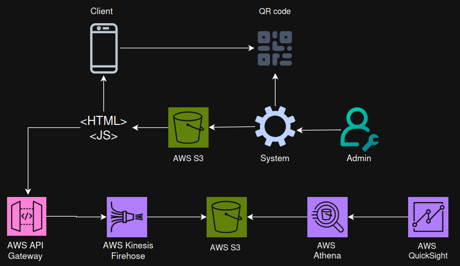

**Project Name: "Architecting Solutions on AWS"**

**Case 2: "Designing a serverless data analytics on AWS"**
```
🧾 Client Requirements

🧩 Current System (Baseline)
    - Static website hosted on Amazon S3
    - Displays restaurant menus (HTML pages)
    - Admin system allows restaurants to update menus
    - QR codes per restaurant link to menu pages

Customers:
    - Scan QR → view menu
    - Still must wait for waiter to place order ❌ (pain point)

🚨 Business Goals / Problems
    - Reduce delay between menu selection and ordering
    - Improve customer experience
    - Enhance restaurant operational efficiency
```
```
🆕 New Functional Requirements

1. 🍽️ Online Ordering
    - Add “Order item” capability directly from menu
    - Call existing backend API (already built)
    - Use QR per table as order identifier

2. 📊 Data Analytics (Key Requirement)
    - Collect clickstream data (user behavior tracking)

Insights needed:
    - Which dishes users view
    - Scroll behavior (drop-off points)
    - Time spent on items
    - View → order conversion

Enable:
    - Menu optimization
    - BI (business intelligence) reporting
    - Personalized recommendations (session-based)

3. 🌐 Data Ingestion Interface
Must support:
    - RESTful HTTPS endpoint
    - Accept HTTP POST requests

Client already has:
    - JavaScript library to send events

⚙️ Non-Functional Requirements

💰 Cost Optimization
    - Prefer pay-per-use (serverless) pricing
    - Avoid always-on infrastructure
🛠️ Operational Simplicity
    - Prefer managed services
    - Avoid: EC2 instances and OS maintenance
🔐 Security & Compliance
    - Encryption: In transit (HTTPS) and at rest
    - Secure data handling
🌍 Reliability & Durability
    - Data backup in multiple AWS Regions
    - High durability storage
```
```
🏗️ Final Solution Overview (High-Level Flow)
```

```
🧩 Clickstream Data Pipeline:

    Client (JS library) → Amazon API Gateway → Amazon Kinesis Data Firehose → Amazon S3 → Amazon Athena → Amazon QuickSight

🧩 Solution Components Explained
🌐 1. Data Ingestion Endpoint
    - Amazon API Gateway
        - Provides HTTPS REST endpoint
        - Acts as a secure proxy
    - Handles: Custom domains and SSL certificates
    - Sends incoming requests to Firehose

🔥 2. Data Streaming & Delivery
    - Amazon Kinesis Data Firehose
        - Core data ingestion service
        - Buffers and batches incoming data
        - Delivers data efficiently to S3
        - Avoids exposing internal services to the internet

💾 3. Storage Layer
    - Amazon S3
        -Stores raw clickstream data (JSON files)
    - Chosen because:
        -Decoupled from compute
        -Highly durable & scalable
        -Integrates with multiple analytics tools

⚙️ 4. Optional Data Processing
    - AWS Lambda (triggered by S3 events)
        - Runs only when new files arrive
    - Can:
        -Clean / validate data
        -Fix malformed records
        -Enrich data (e.g., from DBs)

🪣 Storage Strategy:
        -Raw data bucket (original data)
        -Processed data bucket (cleaned/enriched data)

🔍 5. Data Querying
    - Amazon Athena
        -Query S3 data using SQL
        -No need for new query language
        -Schema must match JSON structure
        -Outputs query results as tables

📊 6. Data Visualization
    - Amazon QuickSight
        -Builds dashboards and reports
    - Enables:
        -Menu performance insights
        -User behavior analysis
        -Business intelligence reporting
        -Reuses existing company setup (no retraining needed)
```
```
🎯 How This Solves the Client’s Problems

✅ Meets Functional Requirements
✔ Accepts clickstream data via HTTPS
✔ Stores and processes large-scale event data
✔ Enables analytics on user behavior
✔ Supports visualization and insights


⚙️ Meets Non-Functional Requirements

💰 Cost Efficient
    - Fully serverless (pay-per-use)
    - No cost during idle hours
🛠️ Low Maintenance
    - No servers (no EC2)
    - Fully managed AWS services
🔐 Secure
    - HTTPS ingestion
    - Supports encryption (in transit & at rest)
📈 Scalable & Reliable
    - Handles thousands of restaurants
    - Automatic scaling
    - Durable storage (S3)
🧠 Key Design Decisions
    - API Gateway in front of Firehose
    - Adds security and flexibility
    - S3 as central data lake
    - Decouples storage from processing
    - Athena for serverless querying
    - No infrastructure needed
    - Optional Lambda processing
    - Adds flexibility without complexity
    - QuickSight reuse
    - Saves cost and training effort
```

```
👉 AWS Services

🛠️ Data lakes and data storage

⚙️ Amazon S3

- Amazon Simple Storage Service (Amazon S3) is an object storage service that offers scalability, data availability, security, and performance. 
- Customers of all sizes and industries can store and protect virtually any amount of data for virtually any use case, such as data lakes, cloud-native applications, and mobile apps. 
- With cost-effective storage classes and easy-to-use management features, you can optimize costs, organize data, and configure fine-tuned access controls to meet specific business, organizational, and compliance requirements.

The following list details some use cases for Amazon S3:

    Archive data at the lowest cost: Move data archives to the Amazon S3 Glacier storage classes to lower costs, reduce operational complexities, and gain new insights.

    Run cloud-native applications: Build fast, powerful, mobile and web-based cloud-native applications that scale automatically in a highly available configuration, such as static websites that use the client side for coding.

    Build a data lake: Run big data analytics, artificial intelligence (AI), machine learning (ML), and high performance computing (HPC) applications to unlock data insights.

    Back up and restore critical data: Meet Recovery Time Objectives (RTO), Recovery Point Objectives (RPO), and compliance requirements with the robust replication features of Amazon S3.

- The Amazon S3 Glacier storage classes are purpose-built for data archiving. They are designed to provide you with high performance, retrieval flexibility, and low-cost archive storage in the cloud. All S3 Glacier storage classes provide virtually unlimited scalability and are designed for 99.999999999% of data durability. In addition to low-cost storage, the S3 Glacier storage classes also deliver options for fast access to your archival data.

⚙️AWS Lake Formation

- AWS Lake Formation is a service that you can use to set up a secure data lake in days. 
- A data lake is a centralized, curated, and secured repository that stores all your data, both in its original form and prepared for analysis. 
- You can use a data lake to break down data silos and combine different types of analytics to gain insights and guide better business decisions.


🛠️ Data analytics

⚙️ Amazon Athena

- Amazon Athena is an interactive query service that you can use to analyze data in Amazon S3 by using standard Structured Query Language (SQL). 
- Athena is serverless, so you don’t need to manage infrastructure, and you pay only for the queries that you run.

- Using Athena is straightforward. You point to your data in Amazon S3, define the schema, and start querying by using standard SQL. Most results are delivered within seconds. 
- With Athena, you don’t need complex extract, transform, and load (ETL) jobs to prepare your data for analysis. 
- Anyone with SQL skills can use Athena to quickly analyze large-scale datasets.

⚙️Amazon OpenSearch Service

- Amazon OpenSearch Service enables to perform interactive log analytics, real-time application monitoring, website search, and more.
- OpenSearch is an open source, distributed search and analytics suite that is derived from Elasticsearch. 
- Amazon OpenSearch Service is the successor to Amazon Elasticsearch Service. It offers the latest versions of OpenSearch, support for 19 versions of Elasticsearch, and visualization capabilities that are powered by OpenSearch Dashboards and Kibana. 

🛠️ Data movement

⚙️ Amazon Kinesis

- With Amazon Kinesis, you can collect, process, and analyze real-time, streaming data so that you can get timely insights and react quickly to new information. 
- Amazon Kinesis offers key capabilities to cost-effectively process streaming data at virtually any scale, along with the flexibility to choose the tools that best suit the requirements of your application. 
- Amazon Kinesis enables ingesting real-time data such as video, audio, application logs, website clickstreams, and Internet of Things (IoT) telemetry data for machine learning, analytics, and other applications. You can use Amazon Kinesis to process and analyze data as it arrives, which means that you can respond quickly—you don’t need to wait for all your data to be collected before processing can begin.

⚙️ AWS Glue

- AWS Glue is a serverless data integration service that you can use to discover, prepare, and combine data for analytics, machine learning, and application development. 
- AWS Glue provides capabilities that are needed for data integration so that you can start analyzing your data and using your data in minutes instead of months. 
- Data integration is the process of preparing and combining data for analytics, machine learning, and application development. 
- It involves multiple tasks, such as discovering and extracting data from various sources; enriching, cleaning, normalizing, and combining data; and loading and organizing data in databases, data warehouses, and data lakes. 

🛠️ AWS DMS

- AWS Database Migration Service (AWS DMS) helps you migrate databases to AWS quickly and securely. 
- The source database remains fully operational during the migration, which minimizes downtime to applications that rely on the database. - AWS DMS can migrate your data to and from the most widely used commercial and open-source databases.
```

