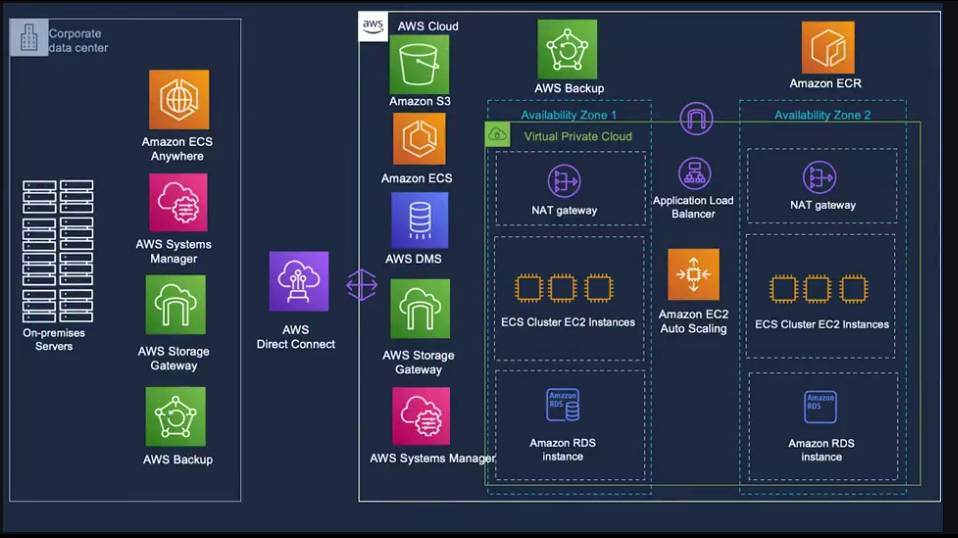

**Project Name: "Architecting Solutions on AWS"**

**Case 3: "Designing a hybrid solution for container based workloads on AWS"**

```
🔍 Client Problems to Resolve

1. Hybrid Migration Challenge

The company is in a partial migration state:
    ~50% of workloads must move to AWS now (contracts expired)
    ~50% must remain on-premises temporarily
This creates a hybrid architecture problem:
    Systems must run across two environments simultaneously
Future goal: full migration to AWS

👉 Core problem: Design a smooth hybrid architecture that supports gradual migration without disruption.

2. High-Performance Connectivity Between On-Prem & AWS
    Continuous communication between environments is required
Workload characteristics:
    High volume of data transfer
    Frequent communication between services
Strict requirements:
    Low latency
    Consistent throughput
    No performance degradation

👉 Core problem: Provide fast, stable, and reliable network connectivity between on-prem and AWS.

3. Cross-Environment Data Sharing
On-prem systems:
    Generate files/data
AWS applications:
    Need to access that data
Preference:
    Store data in AWS (future-proofing)

👉 Core problem: Enable seamless data access and storage in AWS without breaking existing workflows.

4. Containerized Workload Consistency
Current state:
    Applications run in containers (on-prem)
Requirement:
    Continue using containers in AWS
Strong preference:
    Use same tooling and orchestration across environments

👉 Core problem: Maintain consistent container platform & operations across hybrid infrastructure.

5. Private/Internal Application Access
    Applications are internal-only
Requirement:
    No public internet exposure
    Secure access within private networks only

👉 Core problem: Ensure secure, private deployment architecture in AWS.

6. Database Migration (PostgreSQL)
Current:
    PostgreSQL databases on-prem (not containerized)
Plan:
    Migrate databases to AWS
Constraint:
    No code changes / minimal refactoring

👉 Core problem: Migrate databases with high compatibility and minimal disruption.

7. Minimal Code Changes (Lift-and-Shift)
Strong business constraint:
    Avoid rewriting applications
Desired approach:
    Lift-and-shift migration

👉 Core problem: Ensure AWS solution works almost identically to on-prem setup.

8. High Availability & Fault Tolerance
Industry: Insurance (critical systems)
Requirement:
    High uptime
    No single points of failure
    Built-in resilience

👉 Core problem: Design a highly available, fault-tolerant architecture.

9. Tooling & Operational Consistency
Preference for same tools across:
    Container management
    Orchestration
    Operations
Avoid:
    Managing two completely different systems

👉 Core problem: Reduce operational complexity in hybrid environment.
```
```
🧩 Solution Presentation Summary
```

```
1. Network Connectivity Solution
AWS Direct Connect
    Handles high data volume
    Provides low latency & consistent throughput

Chosen over: VPN (less stable for this use case)

2. Container Strategy (Hybrid Consistency)
Amazon ECS for AWS
    ECS Anywhere for on-prem
Benefit:
    Same orchestration tool across environments
    No need to change container code

3. Container Registry Options
Continue with Docker Hub
    Or move to Amazon Elastic Container Registry
Flexibility:
    No forced change

4. Compute & Scaling for Containers
ECS on Amazon EC2 (EC2-based cluster)
    Amazon EC2 Auto Scaling
    Application Load Balancer
Reason:
    Maintain control (AMI, SSH access)
    Keep operations similar to on-prem

5. Database Migration Solution
Amazon RDS for PostgreSQL
    Multi-AZ deployment across Availability Zones
Benefit:
    High availability
    Fault tolerance without code changes

6. File Storage & Data Transfer
AWS Storage Gateway (File Gateway)
    Backend storage in Amazon S3
Key features:
    NFS support (no app changes)
    Local caching → reduces latency
    Async upload to S3

7. Network & Security Design
Architecture:
    Private subnets for ECS & RDS
    Public subnets with NAT Gateway
Benefit:
    No public exposure
    Secure outbound internet access only

8. Operations & Management Tools
AWS Systems Manager (patching, scripts)
AWS Backup
    Benefit:
        Unified management across hybrid environments

🧠 Key Takeaways
Solution fully aligns with:
    Hybrid architecture
    Lift-and-shift approach
    Minimal code changes
Strong focus on:
    Performance (network + storage)
    Resilience (Multi-AZ)
    Consistency (same tools across environments)
```
```
👉 AWS Services

⚙️ AWS Direct Connect

- The AWS Direct Connect cloud service is the shortest path to your AWS resources. 
- While your network traffic is in transit, it remains on the AWS global network and never touches the public internet. 
- This isolation reduces the chance of encountering bottlenecks or unexpected increases in latency. 

- When you create a new connection, you can choose a hosted connection that’s provided by an AWS Direct Connect Delivery Partner, or choose a dedicated connection from AWS—and deploy at over 100 AWS Direct Connect locations around the globe. 
- With AWS Direct Connect SiteLink, you can send data between AWS Direct Connect locations to create private network connections between the offices and data centers in your global network.

- Each dedicated AWS Direct Connect connection consists of a single dedicated connection between ports on your router and an AWS Direct Connect device. 
- Best practice is to establish a second connection for redundancy. When you request multiple ports at the same AWS Direct Connect location, they will be provisioned on redundant AWS equipment. 

- If you have configured a backup Internet Protocol security (IPsec) virtual private network (VPN) connection instead, all virtual private cloud (VPC) traffic will fail over to the VPN connection automatically. 
- Traffic to or from public resources, such as Amazon Simple Storage Service (Amazon S3), will be routed over the internet. 
- If you don’t have a backup AWS Direct Connect link or an IPsec VPN link, then Amazon VPC traffic will be dropped if a failure occurs. Traffic to or from public resources will be routed over the internet.

⚙️ AWS Managed VPN

⚙️AWS Site-to-Site VPN

- By default, instances that you launch into a VPC can't communicate with your own (remote) network. 
- You can enable access to your remote network from your VPC by creating an AWS Site-to-Site VPN connection, and configuring routing to pass traffic through the connection.
- VPN connection is a general term, but in AWS, a VPN connection refers to the connection between your VPC and your own on-premises network. Site-to-Site VPN supports IPsec VPN connections.

⚙️ Virtual private gateway

- A virtual private gateway is the VPN concentrator on the Amazon side of the Site-to-Site VPN connection. 
- You create a virtual private gateway and attach it to the VPC where you want to create the Site-to-Site VPN connection.

- Consider taking this approach when you want to take advantage of an AWS managed VPN endpoint that includes automated redundancy and failover built into the AWS side of the VPN connection.

- The virtual private gateway also supports and encourages multiple user gateway connections so that you can implement redundancy and failover on your side of the VPN connection.

⚙️ AWS Client VPN

- AWS Client VPN is a fully managed, remote-access VPN solution that your remote workforce can use to securely access resources within both AWS and your on-premises network. 
- It’s fully elastic, so it automatically scales up or down, based on demand. When you migrate applications to AWS, your users access the applications in the same way before, during, and after the move. 
- AWS Client VPN, including the software client, supports the OpenVPN protocol.

⚙️ AWS Transit Gateway

- AWS Transit Gateway connects your VPCs and on-premises networks through a central hub. 
- This arrangement simplifies your network and minimizes complex peering relationships. 
- Transit Gateway acts as a cloud router—each new connection is made only once.

- As you expand globally, inter-Region peering connects transit gateways together through the AWS global network. 
- Your data is automatically encrypted and never travels over the public internet.

- Transit Gateway is the hub for the connections between the different networks. Using a transit gateway can make the network easier to manage. 
- You can apply route tables so that the transit gateway can connect networks to each other in a more centralized manner.

⚙️ Amazon ECS launch types

After you choose which container orchestration tool you want to use—either Amazon ECS or Amazon EKS — there are two launch types to pick from:
    EC2: Deploy and manage your own cluster of EC2 instances for running the containers
    AWS Fargate: Run containers directly, without any EC2 instances

Both launch types are good compute options for hosting your containers in a scalable and reliable way. Which launch type you choose will depend on which factors you want to optimize for.

In our case we chose the EC2 launch type because the customer wants to use a custom AMI. The customer also wants to maintain SSH access to underlying instances so they could try to have similar management operations across workloads. AWS Fargate doesn’t support either of these options. Therefore, EC2 was the correct choice for this use case.

⚙️ NAT devices

- NAT device allows resources in private subnets to connect to the internet, other VPCs, or on-premises networks. 
- These instances can communicate with services outside the VPC, but they can’t receive unsolicited connection requests.

- The NAT device replaces the source IPv4 address of the instances with the address of the NAT device. 
- When the NAT device sends response traffic to the instances, the device translates the addresses back to the original source IPv4 addresses.

- NAT gateway is a managed NAT device that’s offered by AWS. 
- You can also create your own NAT device on an EC2 instance, which is called a NAT instance. 
- Best practice is to use NAT gateways because they provide better availability and bandwidth, and administering NAT gateways requires less effort on your part. 
- You can manage how the traffic flows from the private resources to the NAT device by using route tables.

- When you create a NAT gateway, you specify one of the following connectivity types:

    Public (default): Instances in private subnets can connect to the internet through a public NAT gateway, but can’t receive unsolicited inbound connections from the internet. You create a public NAT gateway in a public subnet, and you must associate an elastic IP address with the NAT gateway at creation. You route traffic from the NAT gateway to the internet gateway for the VPC. Alternatively, you can use a public NAT gateway to connect to other VPCs or your on-premises network. In this case, you route traffic from the NAT gateway through a transit gateway or a virtual private gateway.

    Private: Instances in private subnets can connect to other VPCs or your on-premises network through a private NAT gateway. You can route traffic from the NAT gateway through a transit gateway or a virtual private gateway. You can’t associate an elastic IP address with a private NAT gateway. You can attach an internet gateway to a VPC with a private NAT gateway, but if you route traffic from the private NAT gateway to the internet gateway, the internet gateway drops the traffic.

- The NAT gateway replaces the source IP address of the instances with the IP address of the NAT gateway. 
- For a public NAT gateway, this is the elastic IP address of the NAT gateway. 
- For a private NAT gateway, this is the private IP address of the NAT gateway. 
- When the NAT device sends response traffic to the instances, it translates the addresses back to the original source IP address.

⚙️ Amazon RDS

Multi-AZ deployments

- In a Multi-AZ deployment, Amazon RDS automatically creates a primary database (DB) instance and synchronously replicates the data to an instance in a different Availability Zone. 
- When it detects a failure, Amazon RDS automatically fails over to a standby instance without manual intervention. 
- This failover mechanism meets the customer’s need to have a highly available database.

- For even higher availability, the customer could explore deploying two standby DB instances, and use three Availability Zones instead of two.

Read replicas

Customers can also make RDS more highly available by using read replicas.

- Amazon RDS read replicas provide enhanced performance and durability for Amazon RDS DB instances. 
- For read-heavy database workloads, read replicas make it easier to elastically scale out beyond the capacity constraints of a single DB instance. 

- You can create one or more replicas of a given source DB instance and serve high-volume application read traffic from multiple copies of your data, which increases aggregate read throughput. 
- Read replicas can also be promoted to become standalone DB instances, when needed. 
- Read replicas are available in Amazon RDS for MySQL, MariaDB, PostgreSQL, Oracle, Microsoft SQL Server, and Amazon Aurora.

- For the MySQL, MariaDB, PostgreSQL, Oracle, and SQL Server database engines, Amazon RDS creates a second DB instance by using a snapshot of the source DB instance. 
- Amazon RDS then uses the engine’s native asynchronous replication to update the read replica when there’s a change to the source DB instance. 

- The read replica operates as a DB instance that allows only read-only connections. 
- Applications can connect to a read replica like they would connect to any DB instance. Amazon RDS replicates all databases in the source DB instance.

Scaling Amazon RDS instances

- When you create an RDS DB instance, you choose a database instance type and size. 

- Amazon RDS provides a selection of instance types that are optimized to fit different use cases for relational databases. 
- Instance types comprise varying combinations of CPU, memory, storage, and networking capacity. You have the flexibility to choose the appropriate mix of resources for your database. 
- Each instance type includes several instance sizes, which means that you can scale your database to your target workload’s requirements.

- Not every instance type is supported for every database engine, version, edition or Region.

- When you want to scale your DB instance, you can vertically scale the instance and choose a larger instance size. 
- This might be the route you choose to take when you need more CPU and storage ability for an instance.

Use read replicas

- If you need more CPU capabilities but don’t need more storage, you might choose to create read replicas to offload some of the workload to a secondary instance.

Enable RDS Storage Auto Scaling

- If you need more storage, but don’t need more CPU, then you could scale the storage horizontally. 
- You can scale storage horizontally by allocating more storage volumes for your instance manually, or by enabling RDS Storage Auto Scaling. 
- RDS Storage Auto Scaling automatically scales storage capacity in response to growing database workloads, with virtually zero downtime.

- Previously, you needed to manually provision storage capacity based on anticipated application demands. 
- Under provisioning could result in application downtime, and over provisioning could result in underutilized resources and higher costs.
- With RDS Storage Auto Scaling, you set your desired maximum storage limit and Auto Scaling takes care of the rest.

- RDS Storage Auto Scaling continuously monitors actual storage consumption, and scales capacity up automatically when actual utilization approaches provisioned storage capacity. 

- Auto Scaling works with new and existing database instances. 
- You can enable Auto Scaling with a few clicks in the AWS Management Console. 

Change the storage type for increased performance

- If you’re looking for better performance, consider using a different storage type. 
- For example, using Provisioned IOPS instead of General Purpose could give you some of the performance enhancements that you want.

The following list briefly describes the three storage types:

    General Purpose SSD: General Purpose SSD volumes offer cost-effective storage that works well for a broad range of workloads. These volumes deliver single-digit millisecond latencies and the ability to burst to 3,000 IOPS for extended periods of time. Baseline performance for these volumes is determined by the volume's size.

    Provisioned IOPS: Provisioned IOPS storage is designed to meet the needs of I/O-intensive workloads—particularly database workloads—that require low I/O latency and consistent I/O throughput.

    Magnetic: Amazon RDS also supports magnetic storage for backward compatibility. We recommend that you use General Purpose SSD or Provisioned IOPS for any new storage needs. The maximum amount of storage that’s allowed for DB instances on magnetic storage is less than that of the other storage types. 

⚙️ AWS DMS

- AWS Database Migration Service (Amazon DMS) is used to migrate data from their on-premises database to Amazon RDS.

- AWS DMS helps you migrate databases to AWS quickly and securely. 
- The source database remains fully operational during the migration, which minimizes the downtime to applications that rely on the database. 
- The AWS DMS can migrate your data to and from widely used commercial and open-source databases.

- At a basic level, AWS DMS is a server in the AWS Cloud that runs replication software. 
- You create a source and target connection to tell AWS DMS where to extract from and load to. 
- Then, you schedule a task that runs on this server to move your data. 
- AWS DMS creates the tables and associated primary keys if they don't exist on the target. 
- You can pre-create the target tables yourself, if you prefer. You can also use AWS Schema Conversion Tool (AWS SCT) to create some or all of the target tables, indexes, views, triggers, and so on.

- In homogeneous database migrations, the source and target database engines are the same, or are compatible—such as Oracle to Amazon RDS for Oracle, MySQL to Amazon Aurora, MySQL to Amazon RDS for MySQL, or Microsoft SQL Server to Amazon RDS for SQL Server. Because the schema structure, data types, and database code are compatible between the source and target databases, this kind of migration is typically a one-step process. You create a migration task with connections to the source and target databases, and then start the migration. AWS DMS takes care of the rest. The source database can be located in your own premises outside of AWS, on an Amazon Elastic Compute Cloud (Amazon EC2) instance, or in an Amazon RDS DB instance. The target can be a database in Amazon EC2 or Amazon RDS.

⚙️ AWS Storage Gateway

- AWS Storage Gateway connects an on-premises software appliance with cloud-based storage to provide near-seamless integration with data security features between your on-premises IT environment and the AWS storage infrastructure. 
- You can use the service to store data in the AWS Cloud for scalable and cost-effective storage that helps maintain data security. 
- AWS Storage Gateway offers file-based, volume-based, and tape-based storage solutions.

⚙️ Amazon S3 File Gateway

- Amazon S3 File Gateway supports a file interface into Amazon S3, and it combines a service and a virtual software appliance. 
- By using this combination, you can store and retrieve objects in Amazon S3 by using industry-standard file protocols, such as NFS and Server Message Block (SMB). 
- The software appliance (or gateway) is deployed into your on-premises environment as a virtual machine (VM) that runs on VMware ESXi, Microsoft Hyper-V, or Linux Kernel-based Virtual Machine (KVM) hypervisor. 
- The gateway provides access to objects in Amazon S3 as files or file-share mount points. 
- With S3 File Gateway, you can do the following:
    Store and retrieve files directly by using NFS version 3 or version 4.1.
    Store and retrieve files directly by using SMB file system version 2 or version 3.
    Access data directly in Amazon S3 from any AWS Cloud application or service.
    Manage your Amazon S3 data by using lifecycle policies, S3 Cross-Region Replication (CRR), and versioning. You can think of a S3 File Gateway as a file system mount on Amazon S3.

- Amazon S3 File Gateway is designed to simplify file storage in Amazon S3. 
- It integrates to existing applications through industry-standard file system protocols, and it provides a cost-effective alternative to on-premises storage. 
- Amazon S3 File Gateway also provides low-latency access to data through transparent local caching. 
- It manages data transfer to and from AWS, and it optimizes and streams data in parallel. 
- Amazon S3 File Gateway also buffers applications from network congestion, and manages bandwidth consumption.

⚙️ AWS Systems Manager

- By using AWS Systems Manager, you have visibility and control of your infrastructure on AWS. 
- Systems Manager provides a unified user interface that you can use to view operational data from multiple AWS services and automate operational tasks across your AWS resources.

- With Systems Manager, you can group resources—such as Amazon Elastic Compute Cloud (Amazon EC2) instances, Amazon Simple Storage Service (Amazon S3) buckets, or Amazon Relational Database Service (Amazon RDS) instances—by application. 
- You can also view operational data for monitoring and troubleshooting, and take action on your groups of resources.

- Systems Manager is designed to simplify resource and application management, reduce the time needed to detect and resolve operational problems, and make it easier to operate and manage your infrastructure securely at scale.

    1. Access Systems Manager: Use one of the available options for accessing Systems Manager, such as the AWS Management Console or the AWS Command Line Interface (AWS CLI).

    2. Choose a Systems Manager capability: Determine which capability can help you with the action you want to perform on your resources. The diagram shows only a few of the capabilities that IT administrators and DevOps personnel use to manage their applications and resources.

    3. Verification and processing: Systems Manager verifies that your AWS Identity and Access Management (IAM) user, group, or role has the needed permissions to perform the action that you specified. If the target of your action is a managed node, the Systems Manager Agent (SSM Agent) that runs on the node performs the action. For other types of resources, Systems Manager performs the specified action or communicates with other AWS services to perform the action on behalf of Systems Manager.

    4. Reporting: Systems Manager, the SSM Agent, and other AWS services that performed an action on behalf of Systems Manager report their status. Systems Manager can send status details to other AWS services, if configured.

    5. Systems Manager operations management capabilities: If you enable Systems Manager operations management capabilities—such as Explorer, OpsCenter, and Incident Manager—they can aggregate operations data or create artifacts in response to events or errors with your resources. These artifacts include operational work items (OpsItems) and incidents. The operations management capabilities from Systems Manager provide both operational insight into your applications and resources, and automated remediation solutions to help troubleshoot problems.

⚙️ AWS Backup

- AWS Backup is used to centralize and automate data protection across AWS services and hybrid workloads. 
- AWS Backup offers a cost-effective, fully managed, policy-based service that is designed to simplify data protection at scale. 

- AWS Backup also helps you support your regulatory compliance or business policies for data protection. 
- Together with AWS Organizations, you can use AWS Backup to centrally deploy data protection policies to configure, manage, and govern your backup activity across your company’s AWS accounts and resources. 

- Supported resources include the following:
    - EC2 instances
    - Applications that are supported by Windows Volume Shadow Copy Service (VSS)—including Windows Server, Microsoft SQL Server, and Microsoft Exchange Server—on Amazon EC2
    - Amazon Elastic Block Store (Amazon EBS) volumes
    - S3 buckets
    - Amazon RDS databases, including Amazon Aurora clusters
    - Amazon DynamoDB tables
    - Amazon Neptune databases
    - Amazon DocumentDB (with MongoDB compatibility) databases
    - Amazon Elastic File System (Amazon EFS) file systems
    - Amazon FSx for NetApp ONTAP file systems
    - Amazon FSx for Lustre file systems
    - Amazon FSx for Windows File Server file systems
    - Amazon FSx for OpenZFS file systems
    - AWS Storage Gateway volumes
    - VMware workloads on premises, on Amazon Outposts, and in VMware Cloudon AWS

```

