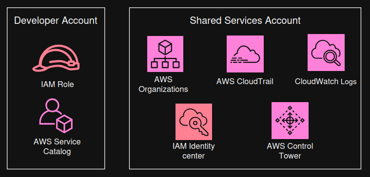

**Project Name: "Architecting Solutions on AWS"**

**Case 4: "Designing a solution following account governance and management best practices on AWS"**

```
🧩 Core Problem

- Everything is running in a single AWS account (prod)
- No proper separation between customers, projects, or environments
- Manual management by one person (Morgan) → not scalable
- Increasing risk of:
    Accidental changes
    Poor access control
    Billing confusion
    Lack of governance

📌 Key Requirements

1. Multi-Account Architecture
Split the current single AWS account into multiple AWS accounts
Logical separation by:
    Projects / customers
    Environments (dev, staging, prod)
    Prevent accidental changes across environments

2. Centralized Access (Shared Services Account)
Create a shared services / management account
    All users log in through a central place
    Avoid creating IAM users in every account

3. Single Sign-On (SSO)
Implement centralized authentication (SSO)
Users authenticate once and access multiple accounts
Improves:
    Security
    User management
    Scalability

4. Identity & Access Management Improvement
Stop using:
    Root user for daily work ❌
Replace with:
    Proper roles and permissions (least privilege)
    Provide controlled access for developers

5. Governance & Security Guardrails
Enforce:
    Policies across all accounts
    Safe configurations
Prevent:
    Misconfigurations
    Unauthorized actions

6. Automated Account Provisioning & Configuration
Ability to:
    Automatically create new AWS accounts
    Apply baseline configurations
    Ensure consistency across environments

7. Centralized Logging Account
Dedicated account for:
    Logs (CloudTrail, API activity, security logs)
Enables:
    Auditing
    Monitoring
    Incident investigation

8. Resource Tagging Enforcement
Current issue:
    Inconsistent or missing tags
Requirement:
    Enforce tagging policies
    Ensure accurate billing and resource tracking

9. Billing & Cost Management
Improve visibility of:
    Costs per project / customer
Move from unreliable tag-based tracking → structured account-based billing

🎯 Overall Goal

Build a scalable, secure, and well-governed AWS environment that:
    Supports company growth
    Enables multiple developers to work safely
    Reduces operational risk
    Improves cost tracking and control
```
```
🏗️ Solution Overview

The solution introduces a governed multi-account AWS architecture using AWS management and governance services to improve:
    Security
    Scalability
    Access control
    Operational management
```

```

🔧 Core Architecture Components

1. Shared Services (Management) Account
    A new central AWS account is created
    Acts as the control hub for the entire environment
    Hosts key governance and access services

2. AWS Organizations, used to:
    Create and manage multiple AWS accounts
    Organize them into a structured hierarchy
    Enables centralized governance across all accounts

3. Service Control Policies (SCPs)
    Applied via AWS Organizations
    Provide security guardrails
    Restrict what accounts/users can do (even if IAM allows it)

4. AWS IAM Identity Center (SSO)
Centralized authentication system
Users:
    Log in once
    Access multiple AWS accounts
    Eliminates need for multiple IAM users across accounts

5. AWS Control Tower automates setup of:
    Multi-account environment
    Governance framework
    Provides best-practice landing zone

6. AWS Service Catalog provides predefined infrastructure templates and ensures:
    Standardized deployments
    Built-in logging and configuration
    Helps developers deploy resources safely

7. AWS CloudTrail (Centralized Logging) captures:
    API activity
    Security events
    Logs are centralized for auditing and monitoring

8. Amazon CloudWatch Logs
    Stores application logs
    Integrated with Service Catalog deployments
    Centralized visibility into workloads

🚀 Implementation Approach (Phased Plan)
- Phase 1: Foundation (Scaffolding)
    Set up:
        Shared Services account
        AWS Organizations
        Control Tower
        SSO (Identity Center)
        Establish governance and account structure
- Phase 2: Infrastructure as Code
    Build infrastructure using IaC (e.g., CloudFormation/Terraform)
    Standardize:
        Account provisioning
        Resource deployment
- Phase 3: Workload Migration
    Gradually move applications to new accounts
    Test and stabilize deployments
- Phase 4: Database Migration
    Use AWS Database Migration Service (DMS)
    Migrate databases without downtime
    Ensure business continuity

🎯 Key Benefits
✅ Strong governance and security controls
✅ Centralized access management (SSO)
✅ Reduced risk of human error
✅ Scalable multi-account structure
✅ Standardized and automated deployments
✅ Full visibility via centralized logging
```
```
👉 AWS Services

⚙️ Multi-Account Strategies 

- The practice of using multiple accounts has many advantages. 
- You can group workloads based on business purposes and ownership, centralize logging, and constrain access to sensitive data. 
- You can also limit the scope of impact from adverse events, manage costs better, and distribute AWS service quotas and API request rate limits.

⚙️ Group workloads based on business purpose and ownership

- You can group workloads with a common business purpose into distinct accounts. 
- As a result, you can align the ownership and decision-making of those accounts. 
- You can also avoid dependencies and conflicts with how workloads in other accounts are secured and managed.

- Different business units or product teams might have different processes. 
- Depending on your overall business model, you might choose to isolate distinct business units or subsidiaries in different accounts. 
- By isolating business units, they can operate with greater decentralized control—while still retaining the ability to provide overarching guardrails. 
- This approach might also ease divestment of those units over time.

- Guardrails are governance rules for security, operations, and compliance that you can define and apply to align with your overall requirements.

- If you acquire a business that already operates in AWS, you can move the associated accounts into your existing organization intact.
- This movement of accounts can be an initial step toward integrating acquired services into your standard account structure.

⚙️ Apply distinct security controls by environment

- Workloads often have distinct security profiles that require separate control policies and mechanisms to support them. For example, it’s common to apply different policies for security and operations to the non-production and production environments of a given workload. 
- If you use separate accounts for the non-production and production environments, the resources and data that make up a workload environment are separated from other environments and workloads by default.

⚙️ Constrain access to sensitive data

- When you limit sensitive data stores to an account that is built to manage it, you can more easily constrain the number of people and processes that can access and manage the data store. 
- This approach simplifies the process of achieving least-privilege access. 
- Limiting access at the coarse-grained level of an account helps contain exposure to highly sensitive data.
- For example, by designating a set of accounts to house publicly accessible Amazon Simple Storage Service (Amazon S3) buckets, you can implement policies that expressly forbid all other accounts from making S3 buckets publicly available.

⚙️Promote innovation and agility

- At AWS, technologists are referred to as builders, because they’re responsible for building value by using AWS products and services.
- Your builders might represent diverse roles, such as application developers, data engineers, data scientists, data analysts, security engineers, and infrastructure engineers.

- In the early stages of a workload’s lifecycle, you can help promote innovation by providing your builders with separate accounts in support of experimentation, development, and early testing. 
- These environments often provide greater freedom than more tightly controlled production-like test and production environments. 
- They do so by providing broader access to AWS services while also using guardrails that help prohibit access to (and the use of) sensitive and internal data.

    Sandbox accounts: Typically disconnected from your enterprise services and don’t provide access to your internal data. However, they offer the greatest freedom for experimentation.

    Development accounts: Typically provide limited access to your enterprise services and development data. However, they can more readily support day-to-day experimentation with your enterprise-approved AWS services, formal development, and early testing work.

- You can support later stages of the workload lifecycle by using distinct test and production accounts for workloads or groups of related workloads. 
- By having an environment for each set of workloads, owning teams can move faster by reducing dependencies on other teams and workloads, and by also minimizing the impact of changes.

⚙️ Limit scope of impact from adverse events

- An AWS account applies boundaries for security, access, and billing boundaries to your AWS resources. 
- These boundaries can help to achieve the independence and isolation of resources. 
- By design, all resources that are provisioned within an account are logically isolated from resources that are provisioned in other accounts—even within your own AWS environment.

- This isolation boundary provides a way to limit the risks of an application-related issue, misconfiguration, or malicious actions. 
- If an issue occurs within one account, impacts to workloads contained in other accounts can be either reduced or eliminated.

⚙️ Support multiple IT operating models

- Organizations often have multiple IT operating models, or ways that they divide responsibilities among parts of the organization to deliver their application workloads and platform capabilities. The following diagram shows three example operating models:
- Example operating models

    1. In the Traditional Ops model, teams who own custom and commercial off-the-shelf (COTS) applications are responsible for engineering their applications, but not for their production operations. A cloud platform engineering team is responsible for engineering the underlying platform capabilities. A separate cloud operations team is responsible for the operations of both applications and platform.

    2. In the CloudOps model, application teams are also responsible for production operations of their applications. In this model, a common cloud platform engineering team is responsible for both the engineering and operations of the underlying platform capabilities.

    3. In the DevOps model, the application teams take on the additional responsibilities of engineering and operating platform capabilities that are specific to their applications. A cloud platform engineering team is responsible for the engineering and operations of shared platform capabilities that are used by multiple applications.

- As a practice, IT Service Management (ITSM) is a common element across all of the models. Your overall goals and requirements for ITSM might not change across these models. 
- However, the responsible individuals and solutions for meeting those goals and requirements can vary, depending on the model.

- Given the implications of centralized operations versus more distributed operational responsibilities, you might benefit from establishing separate groups of accounts in support of different operating models. By using separate accounts, you can apply distinct governance and operational controls that are appropriate for each of your operating models.

⚙️ Manage costs

- An account is the default way that AWS costs are allocated. 
- By using different accounts for different business units and groups of workloads, you can more easily report, control, forecast, and budget your cloud expenditures.

- In addition to cost reporting at the account level, AWS has built-in support to consolidate and report costs across your entire set of accounts. 
- When you require fine-grained cost allocation, you can apply cost allocation tags to individual resources in each of your accounts.

⚙️ Distribute AWS service quotas and API request rate limits

- AWS service quotas (also known as limits) are the maximum number of service resources or operations that apply to an account. 
- For example, a service quota could be the number of S3 buckets that you can create for each account.

- You can use the Service Quotas service to help protect you from unexpected or excessive provisioning of AWS resources, and from malicious actions that could dramatically impact your AWS costs.

- AWS services can also throttle (or limit) the rate of requests that are made to their API operations.

- Because service quotas and request rate limits are allocated for each account, use separate accounts for workloads to help distribute the potential impact of the quotas and limits.

⚙️ IAM Roles, Trust Relationships, and Permissions

⚙️ IAM roles

- An IAM role is an identity that you can create in your account, and it has specific permissions. 
- An IAM role has some similarities to an IAM user. 
- Roles and users are both AWS identities with permissions policies that determine what the identity can or can’t do in AWS. 
- However, instead of being uniquely associated with one person, a role can be assumed by anyone who needs it. 
- Also, a role doesn’t have standard long-term credentials (such as a password or access keys) associated with it. 
- Instead, when you assume a role, it provides you with temporary security credentials for your role session.Roles can be used by the following entities:
    An IAM user in the same AWS account as the role
    An IAM user in a different AWS account than the role
    An AWS service, such as Amazon Elastic Compute Cloud (Amazon EC2)
    An external user who was authenticated by an external identity provider (IdP) service that’s compatible with Security Assertion Markup Language (SAML) 2.0, OpenID Connect (OIDC), or a custom-built identity broker.

⚙️ AWS service role

- An AWS service role is a role that a service assumes to perform actions in your account on your behalf. 
- When you set up some AWS service environments, you must define a role for the service to assume. 
- This service role must include all the permissions that the service needs to access the AWS resources that it must work with. 
- Service roles vary from service to service, but many allow you to choose your permissions if you meet the documented requirements for that service. 
- You can create, modify, and delete a service role from within IAM.

⚙️ AWS service-linked role

- An AWS service-linked role is a unique type of service role that’s linked directly to an AWS service. 
- Service-linked roles are predefined by the service, and they include all permissions that the service needs to call other AWS services on your behalf. 
- The linked service also defines how you create, modify, and delete a service-linked role. 
- A service might automatically create or delete the role. It might allow you to create, modify, or delete the role as part of a wizard or process in the service. 
- Or it might require you to use IAM to create or delete the role. 
- Regardless of the method, service-linked roles make setting up a service easier because you don't need to manually add the necessary permissions.

⚙️ Delegation

- Delegation is the granting of permissions to someone to allow access to resources that you control. 
- Delegation involves setting up a trust between two accounts. The first account is the account that owns the resource (the trusting account). 
- The second account is the account that contains the users that need to access the resource (the trusted account). 
- The trusted and trusting accounts can be any of the following:
    The same account
    Separate accounts that are both under your organization's control
    Two accounts owned by different organizations

- To delegate permissions to access a resource, you create an IAM role in the trusting account that has two policies attached. 
- The permissions policy grants the user of the role the needed permissions to carry out the intended tasks on the resource. 
- The trust policy specifies which trusted account members are allowed to assume the role.

- When you create a trust policy, you can’t specify a wildcard (*) as a principal. 

- The trust policy is attached to the role in the trusting account, and comprises half of the permissions. 
- The other half is a permissions policy that’s attached to the user in the trusted account. 
- The permissions policy allows that user to switch to (or assume) the role. 
- A user who assumes a role temporarily gives up his or her own permissions, and instead takes on the role’s permissions. 
- When the user exits (or stops using) the role, their original user permissions are restored. 
- An additional parameter that’s called external ID can help ensure the secure use of roles between accounts that are not controlled by the same organization.

⚙️ Federation

- Federation is the creation of a trust relationship between an external IdP and AWS. 
- Users can sign in to a web identity provider, such as Login with Amazon, Facebook, Google, or any IdP that is compatible with OIDC.
- Users can also sign in to an enterprise identity system that’s compatible with SAML 2.0, such as Microsoft Active Directory Federation Services. 
- When you use OIDC and SAML 2.0 to configure a trust relationship between these external IdPs and AWS, the user is assigned to an IAM role. 
- The user also receives temporary credentials that allow the user to access your AWS resources.

⚙️ Federated user

- Instead of creating an IAM user, you can use existing identities from AWS Directory Service, your enterprise user directory, or a web identity provider. 
- These identities are known as federated users. AWS assigns a role to a federated user when access is requested through an identity provider.

⚙️ Trust policy

- A trust policy is a JSON policy document where you define the principals that you trust to assume the role. 
- A role trust policy is a required, resource-based policy that’s attached to a role in IAM. 
- The principals that you can specify in the trust policy include users, roles, accounts, and services.

⚙️ Permissions boundary

- A permissions boundary is an advanced feature where you use policies to limit the maximum permissions that an identity-based policy can grant to a role. 
- You can’t apply a permissions boundary to a service-linked role.

⚙️ Principal

- A principal is an entity in AWS that can perform actions and access resources. 
- A principal can be an AWS account root user, an IAM user, or a role.

⚙️ AWS IAM Identity Center 

- AWS IAM Identity Center helps you securely create or connect your workforce identities and manage their access centrally across AWS accounts and applications. 
- IAM Identity Center is the recommended approach for workforce authentication and authorization on AWS for organizations of any size and type.

⚙️ IAM Identity Center features

- IAM Identity Center includes the following core features:

    1. Workforce identities
        Human users who are members of your organization are also known as workforce identities or workforce users. You can create workforce users and groups in IAM Identity Center. You can also connect and synchronize to an existing set of users and groups in your own identity source for use across all your AWS accounts and applications. Supported identity sources include Microsoft Active Directory Domain Services, and external identity providers such as Okta Universal Directory or Microsoft Azure AD.

    2. Application assignments for SAML applications
        With application assignments, you can grant your workforce users in IAM Identity Center SSO access to Security Assertion Markup Language (SAML) 2.0 applications, such as Salesforce and Microsoft 365. Your users can access these applications in a single place, without the need for you to set up federation separately.

    3. Identity Center enabled applications
        AWS applications and services—such as Amazon Managed Grafana, Amazon Monitron, and Amazon SageMaker Studio Notebooks—discover and connect to IAM Identity Center automatically to receive sign-in and user directory services. This feature provides users with a consistent SSO experience for these applications, with no additional application configuration. Because the applications share a common view of users, groups, and group membership, users can also have a consistent experience when they share application resources with others.

    4. Multi-account permissions
        With multi-account permissions, you can plan for and centrally implement IAM permissions across multiple AWS accounts at one time, without the need for you to configure each of your accounts manually. You can create fine-grained permissions based on common job functions, or define custom permissions that meet your security needs. You can then assign those permissions to workforce users to control their access over specific accounts.

    5. AWS access portal
        The AWS access portal provides your workforce users with one-click access to all their assigned AWS accounts and cloud applications through a web portal.

⚙️ AWS Control Tower

- AWS Control Tower offers a straightforward way to set up and govern an AWS multi-account environment that follows prescriptive best practices. 
- AWS Control Tower orchestrates the capabilities of several other AWS services including AWS Organizations, AWS Service Catalog, and IAM Identity Center—to build a landing zone in typically less than an hour. Resources are set up and managed on your behalf.

- AWS Control Tower orchestration extends the capabilities of Organizations. 
- To help protect your organizations and accounts from being affected by drift (or divergence from best practices), AWS Control Tower applies preventive and detective controls (or guardrails). 
- For example, you can use guardrails to help ensure that security logs and necessary cross-account access permissions are created, but not altered.

- If you host more than a handful of accounts, it’s beneficial to have an orchestration layer that facilitates account deployment and account governance. 
- You can adopt AWS Control Tower as your primary way to provision accounts and infrastructure. 
- With AWS Control Tower, you can more easily adhere to corporate standards, meet regulatory requirements, and follow best practices.

- AWS Control Tower uses CloudFormation StackSets to set up resources in your accounts. Each stack set has stack instances that correspond to accounts, and to AWS Regions per account. 
- AWS Control Tower deploys one stack set instance per account and Region.

⚙️ AWS Service Catalog

- By using AWS Service Catalog, organizations can create and manage catalogs of IT services that are approved for AWS. 
- These IT services can include virtual machine images, servers, software, databases, and more—they can even include complete, multi-tier application architectures.

- Organizations can use AWS Service Catalog to centrally manage commonly deployed IT services. 
- AWS Service Catalog is designed to help organizations achieve consistent governance and meet compliance requirements. 
- End users can quickly deploy only the approved IT services that they need, and these deployments will follow the constraints that your organization sets.

AWS Service Catalog provides the following benefits:

    1. Standardization: Administer and manage approved assets by restricting where the product can be launched, the type of instance that can be used, and many other configuration options. The result is a standardized landscape for product provisioning for your entire organization.

    2. Self-service discovery and launch: Users browse listings of products (that is, services or applications) that they can access, locate the product that they want to use, and launch it on their own as a provisioned product.

    3. Fine-grained access control: Administrators assemble portfolios of products from their catalog, and add constraints and resource tags that will be used when the products are provisioned. Administrators then grant access to the portfolio through AWS Identity and Access Management (IAM) users and groups.

    4. Extensibility and version control: Administrators can add a product to different portfolios and restrict it without creating another copy. When the product is updated to a new version, the update is propagated to the product in every portfolio that references it.
```